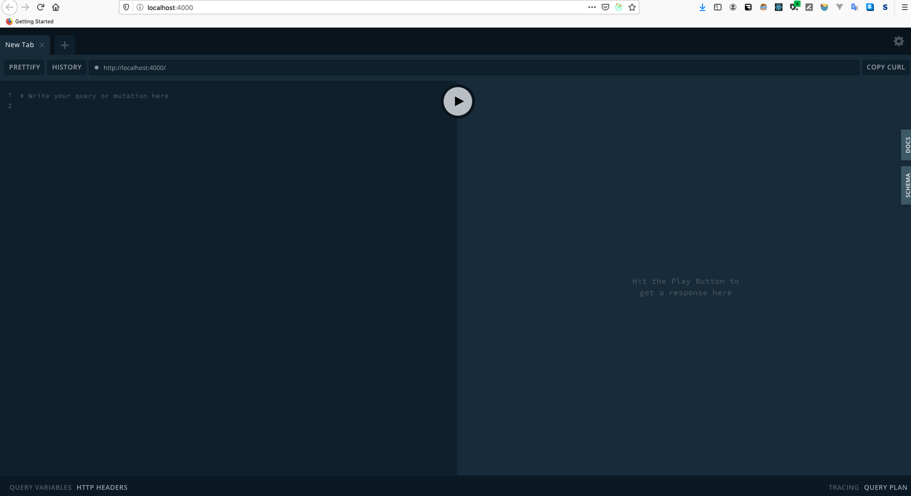

- [主页](../README.md)

# 构建Schema
## 为你的Graph Data构建一个蓝图

构建`Graph API`的第一步就是构建其`Schema`。 你可以将`schema`视为可以在graph中访问的所有数据的蓝图。

在本节中，你将学习如何使用Apollo去构建Graph的`schema`。

### 建立Apollo Server

在写schema之前，我们需要去建立我们的graph API的服务。Apollo Server是一个库，它可以帮助你构建graph API，并且它可以连接到任何数据源，包括REST API 和数据库，并且与开发人员工具无缝集成。

OK，现在到根目录下，去下载我们的依赖，输入下列命令
```shell
    cd start/server && npm install
```
你启动Apollo服务你需要两个包，appolo-server 和 graphql. 接着copy下列代码到src/index.js下

***src/index.js***

```javascript
const { ApolloServer } = require('apollo-server');
const typeDefs = require('./schema');

const server = new ApolloServer({ typeDefs });
```

构建graph API, 你需要从`apollo-server`引入`ApolloServer`类, 我们同样需要在src/schema.js中引入这个类。
接下来，让我们创建`ApolloServer`的新实例，并将`schema`传递到配置对象上的`typeDefs`属性。

### 开始写graph的schema

OK，先讲一下什么是`graph schema`

每一个graph API均以其`schema`为中心，中文翻译为模式，我觉得有点词不达意。就暂且不翻译了。`schame`其实说白了就是定义了一种数据流向的通道。它连接了所有数据类型以及他们之间的关系,类似于一张关系图，`schema`还定义了我们可以通过查询获取哪些数据，以及我们可以更新哪些数据。它是强类型的，这就解锁了强大的开发工具。

由于`schema`位于客户端和底层服务之间，所以它是前端和后端团队协作的完美中间地带

建议大家，去多练习构建schema的基础。

思考一下，为构建这个应用，我们应该需要哪些数据？

- 查询所有即将发射的发射器
- 使用ID查询特定的火箭发射器
- 用户登陆
- 登陆用户预定火箭旅行
- 登陆用户取消火箭旅行

我们的`schema`都要基于这些特性。在`src/schema.js`中，引入gql，并创建一个叫`typeDefs`的变量。
你的`schema`将写在`gql`里面。

***src/schema.js***

```javascript
const { gql } = require('apollo-server');

const typeDefs = gql`


`;

module.exports = typeDefs;
```

### 查询类型

我们将从`查询类型`开始，这是schema的入口点，描述了可以获取的数据

在`src/schema.js`文件内定义gql的反引号之间，copy这段代码。

***src/schema.js***

```javascript
type Query {
  launches: [Launch]!
  launch(id: ID!): Launch
  # Queries for the current user
  me: User
}
```

首先，我们定义一个`launches`的查询，这个查询会返回一个数组并且不能为null。在Graph QL里由于所有类型默认可以为null，所以我们需要定义`！`保证我们查询都有值。接下来我们定义一个通过ID查询数据的方法`launch`，返回单个`Launch`.最后，我们增加一个叫`me`的查询，来查询当前用户的数据。可以在`me` 方法上增加注释。

我们如何定义`Launch`和`User`的属性呢？对于这些类型，我们需要定义一个GraphQL对象类型。

### 对象 & 数量类型

让我们通过创建对象类型来定义`Launch`的结构，像上面一样，我们将下列代码copy到反引号内

***src/schema.js***

```javascript
type Launch {
  id: ID!
  site: String
  mission: Mission
  rocket: Rocket
  isBooked: Boolean!
}
```

`Launch`类型的字段与对象和数量类型相对应。数量类型是基本类型，例如ID， String，Boolean或 Int。你可以将基本类型视为所有字段都解析为`graph`的叶子. `GraphQL`内置了许多基本类型。你可以自定义基本类型，比如：`Date`。

下面来定义这些字段

***src/schema.js***

```javascript
type Rocket {
  id: ID!
  name: String
  type: String
}

type User {
  id: ID!
  email: String!
  trips: [Launch]!
}

type Mission {
  name: String
  missionPatch(size: PatchSize): String
}

enum PatchSize {
  SMALL
  LARGE
}
```

⚠️ 你可能会注意到, `missionPatch`字段接受`size`参数。 GraphQL具有灵活性，因为任何字段都可以包含参数，而不仅仅是查询。`size`参数对应于一个枚举类型，我们在底部使用`PatchSize`进行定义。

还有一些不常见的类型，点击查看哦，😂 [cheat sheet](https://devhints.io/graphql#schema)


### 基因突变类型😄（更改数据）

现在我们定义`Mutation type`, `Mutation`类型是我们Graph中用于修改数据的入口点。就像查询类型一样。`Mutation`类型是一个特殊的类型。

***src/schema.js***

```javascript
type Mutation {
  #if false, booking trips failed -- check errors
  bookTrips(launchIds: [ID]!): TripUpdateResponse!

  # if false, cancellation failed -- check errors

  cancelTrip(launchId: ID!): TripUpdateResponse!

  # login token
  login(email: String): String
}
```
`bookTrips`和`cancelTrip`突变都接受一个参数返回`TripUpdateResponse`. GraphQL突变的返回类型完取决与你。建议定义一个特殊的响应类型，以确保将正确的响应返回给客户端。 在较大的项目中，您可以将此类型抽象为接口，但是现在，我们将定义TripUpdateResponse：

***src/schema.js***

```javascript
type TripUpdateResponse {
  success: Boolean!
  message: String
  launches: [Launch]
}
```

我们的突变响应类型包含成功状态，相应的消息以及我们更新的启动。 最好返回要更新的数据，以使Apollo Client缓存自动更新。

### 启动服务

现在我们已经确定了应用程序的`schema`范围，让我们通过调用`server.listen（）`运行服务器。
***src/index.js***

```javascript
const { ApolloServer } = require('apollo-server');
const typeDefs = require('./schema');

const server = new ApolloServer({ typeDefs });

server.listen().then(({ url }) => {
  console.log(`🚀 Server ready at ${url}`);
});
```

在`terminal`终端中运行 `npm start` 去启动你的服务 🎉 Apollo Server将会启动在可用的端口号4000上


### 浏览你的schema

默认的，Apollo Server 提供了[GraphQL Playground](https://www.apollographql.com/docs/apollo-server/testing/graphql-playground/)。它相当于GraphQL IDE你可以在上面查询，测试，Have fun！！！！ 🎉 🎉 🎉 🎉 🎉

另外`GraphQL Playground`提供了一种相当与自检查的装置，可以点击`schema`按钮进行查看哦。




- [上一页](./get_started.md)   [下一页](./hook_up_datasource.md)