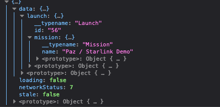

- [主页](../README.md)

# 连接你的API到客户端
## 把你的Graph连接到Apollo客户端

本章你会学到，如何使用React.js写的web客户端连接到后端服务，调用API。你还将了解如何构建身份验证和分页等基本功能，以及优化工作流的技巧。

## 建立好你的开发环境

此时在你的根目录下，在terminal里cd 进入client/目录下。

```shell
cd start/client && npm install
```

下面我介绍一下，我们前端package.json引入的一些依赖：

`apollo-clinet`: 一个完全智能的数据缓存管理解决方案，我们将使用Apollo  Client 3.0，它包含本地状态管理功能。你可以配置管理你的缓存。
`react-apollo`: 用于`Query`和`Mutation`与view层集成的组件
`graphql-tag`: 标记函数gql，我们使用它来包装查询字符串，为了将它们解析为AST


接下来，让我们配置一下Apollo, 创建一个`apollo.config.js`的文件，并粘贴下列代码进去.
这个文件主要是配置web应用名和服务名

```javascript
module.exports = {
  client: {
    name: 'Space Explorer [web]',
    service: 'space-explorer',
  },
};
```

## 创建一个Apollo Client

现在我们已经安装了必要的包，让我们创建一个ApolloClient实例。

定位到`src/index.js`， 让我们来配置我们的URL，此URL就是指向后端服务的URL。

***src/index.js***
```javascript
import { ApolloClient } from 'apollo-client';
import { InMemoryCache } from 'apollo-cache-inmemory';
import { HttpLink } from 'apollo-link-http';

const cache = new InMemoryCache();
const link = new HttpLink({
  uri: 'http://localhost:4000/'
});

const client = new ApolloClient({
  cache,
  link
});
```
仅仅需要几行代码，我们的客户端就可以获取数据了。😄🎉🎉🎉🎉🧨🧨🧨

## 创建第一个查询

在向你展示如何使用Apollo的React集成之前，让我们先用普通的JavaScript发送一个查询。

使用`client.query()`来调用并查询graph的API。首先引入下列代码
```javascript
import gql from "graphql-tag";
```

并将下面的代码添加到index.js的底部

```javascript
// ... above is the instantiation of the client object.
client
  .query({
    query: gql`
      query GetLaunch {
        launch(id: 56) {
          id
          mission {
            name
          }
        }
      }
    `
  })
  .then(result => console.log(result));
```

使用`npm start`将你的前端应用启动起来，打开浏览器，输入地址`http://localhost:3000/`, 打开开发者工具
在console里就可以看到你调用的graph API的数据。Apollo Client 提供了原生的JavaScript的调用方式。但如果用框架的话，这样的调用会更方便。



## 如何集成GraphQL到react里

要将Apollo客户端连接到React，我们将把我们的应用程序包装在从`@ apollo / react-hooks`包导出的`ApolloProvider`组件中，并将client传递到`client` prop。 `ApolloProvider`组件类似于React的上下文提供程序。 它包装了你的React应用程序并将客户端放在上下文中，这使你可以从组件树中的任何位置访问它。

打开`src / index.js`并添加以下代码行：
***src/index.js***

```javascript

import { ApolloProvider } from '@apollo/react-hooks';
import React from 'react';
import ReactDOM from 'react-dom';
import Pages from './pages';

// previous variable declarations

ReactDOM.render(
  <ApolloProvider client={client}>
    <Pages />
  </ApolloProvider>, document.getElementById('root')
);

```
OK, 现在我们准备使用`userQuery` Hook来创建我们第一个组件。

- [上一页](./graph_resolvers.md)   [下一页](./fetch_data_with_queries.md)